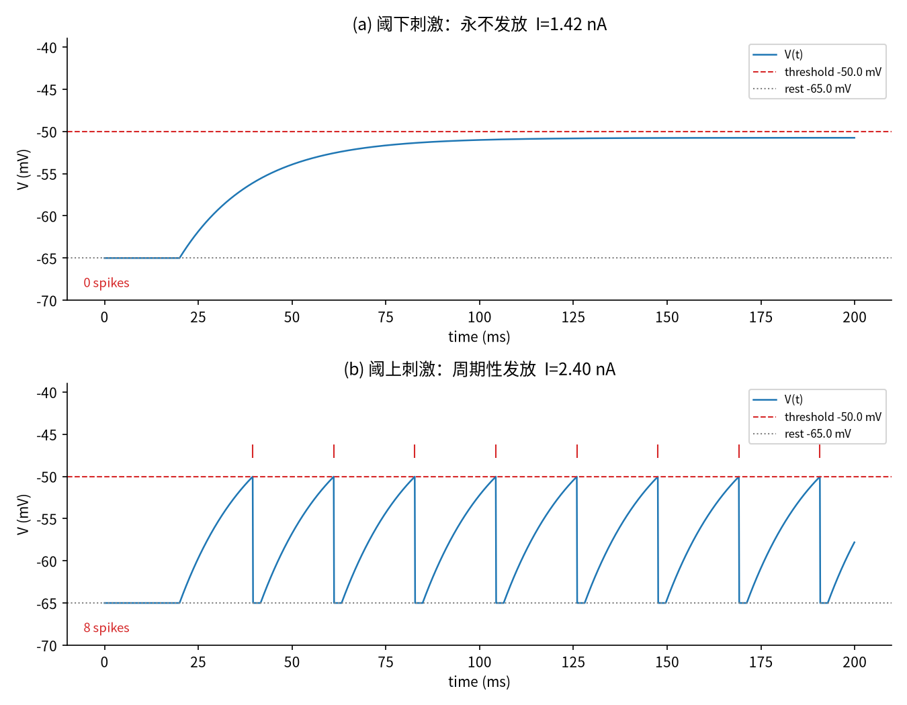
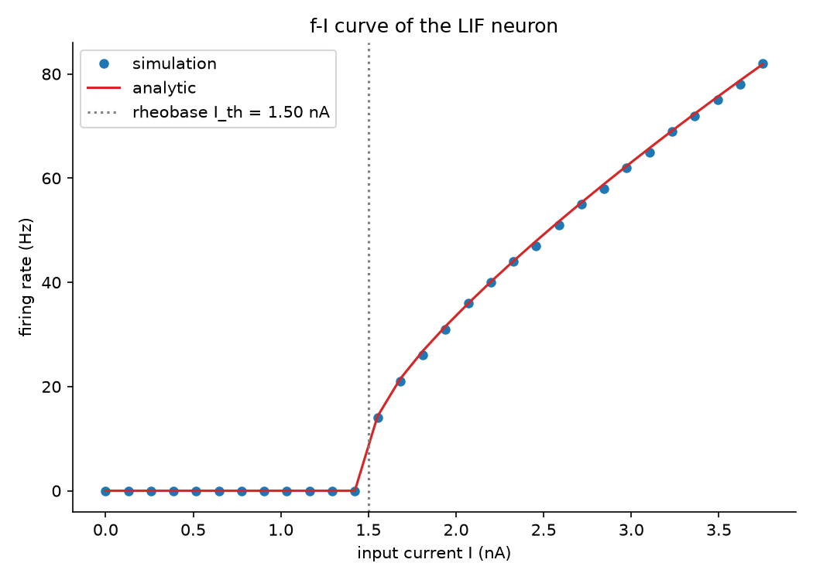
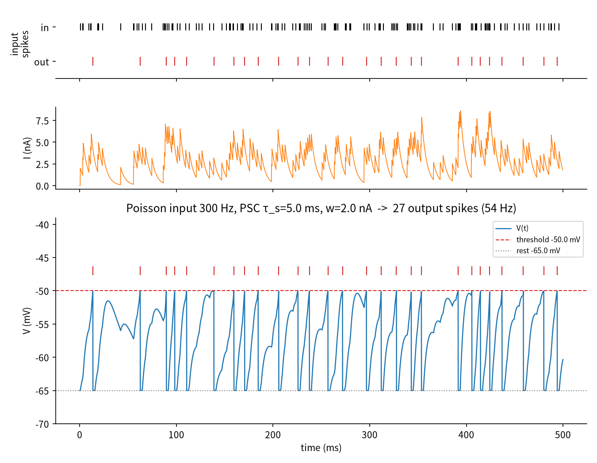

# Biocomputing Lab

用 Python 从零模拟神经元计算的个人实验室，学习笔记 + 可复现实验。
仓库：<https://github.com/gminge/biocomputing>

## 路线图

| 阶段 | 主题 | 状态 |
|------|------|------|
| 1 | 模拟单个神经元（LIF 模型） | ✅ 进行中 |
| 2 | 神经元之间的连接（突触） | ⬜ |
| 3 | 简单的脉冲神经网络 | ⬜ |
| 4 | STDP 突触可塑性学习 | ⬜ |
| 5 | 用脉冲网络完成简单任务 | ⬜ |
| 6 | 更复杂的神经元模型（Hodgkin-Huxley 等） | ⬜ |
| 7 | 神经形态计算 | ⬜ |
| 8 | 真实生物神经元计算 | ⬜ |

## 目录结构

```
bclab/                      # 可复用的核心库（随各阶段一起扩展）
├── neurons.py              # 神经元模型：LIF（Phase 6 加入 HH 等）
└── plotting.py             # 统一画图风格

experiments/
└── phase01_single_neuron/  # 第一阶段实验
    ├── exp01_step_current.py   # 阶跃电流 → 膜电位与脉冲
    ├── exp02_fi_curve.py       # f-I 曲线（仿真 vs 解析解）
    ├── exp03_spike_input.py    # 脉冲序列输入的整合发放
    └── figures/                # 实验输出图
```

## 环境

```bash
pip install -r requirements.txt   # numpy + matplotlib
```

## 第一阶段：模拟单个神经元

使用 **LIF（Leaky Integrate-and-Fire）模型**：

```
τ_m · dV/dt = (E_L - V) + R_m · I(t)     当 V < V_th
V ← V_reset                              当 V ≥ V_th，随后进入 t_ref 不应期
```

默认参数：τ_m=20 ms，E_L=V_reset=-65 mV，V_th=-50 mV，R_m=10 MΩ，t_ref=2 ms。
显式欧拉积分，dt=0.1 ms。

### 实验

```bash
python experiments/phase01_single_neuron/exp01_step_current.py
python experiments/phase01_single_neuron/exp02_fi_curve.py
python experiments/phase01_single_neuron/exp03_spike_input.py
```

| 实验 | 现象 | 结果 |
|------|------|------|
| 1.1 阶跃电流 | 阈下刺激（I=1.42 nA < I_th=1.5 nA）电位逼近但永不发放；阈上刺激（I=2.4 nA）周期性发放 ~40 Hz |  |
| 1.2 f-I 曲线 | 发放率随电流单调上升，仿真与解析解误差 < 1 Hz |  |
| 1.3 脉冲输入 | 单个输入脉冲不足以发放，密集脉冲通过时间整合触发输出（143 输入 → 27 输出） |  |

### 观察与结论

- **临界电流（rheobase）**：I_th = (V_th − E_L)/R_m = 1.5 nA。低于它，稳态电位
  V_ss = E_L + R_m·I 永远达不到阈值。
- **频率编码**：连续电流被编码为脉冲频率，f-I 曲线在阈值附近陡升、
  高频时被不应期饱和到 1/t_ref 上限。
- **时间整合**：指数衰减的突触后电流（PSC）让神经元对密集输入脉冲敏感——
  这正是第二阶段突触模型的雏形。
